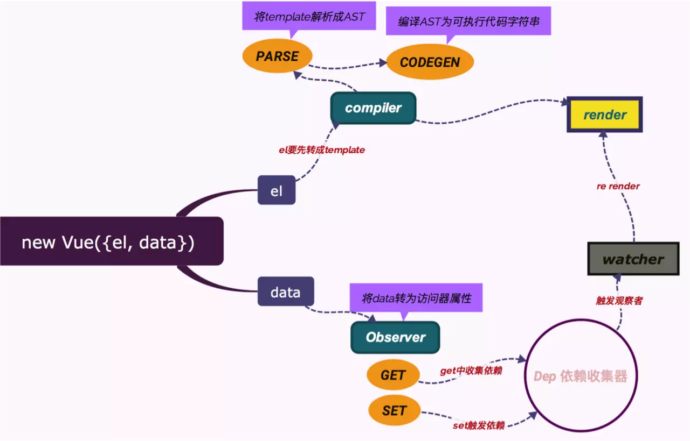

### 实现 Vue 简单的响应式系统

#### 响应式系统


> 代码部分仅实现 data 对象的响应式更新，整个部分的逻辑如上图所示。

#### 核心方法
> 该响应式实现的核心方法为 `Object.defineProperty()`，语法为：

```JS
/**
 * obj          要在其上定义属性的对象。
 * prop         要定义或修改的属性的名称。
 * descriptor   将被定义或修改的属性描述符。
 * @returns     被传递给函数的对象。
 */
Object.defineProperty(obj, prop, descriptor);
```

#### 观察者模式原理
Vue 的实现其实有两条链，一条为 `Object.defineProperty` 来检测数据的变更，从而通知视图层的变化；另一条为 {{ property }} 模板语法，此处涉及到虚拟 DOM 的内容。
数据部分通过 initData 进行初始化，为其中的每个可枚举的数据项进行数据监听。

当 Vue 中的数据触发了 setter 更新时，此时会通知 dep 更新所有已存的 watcher，更新数据内容